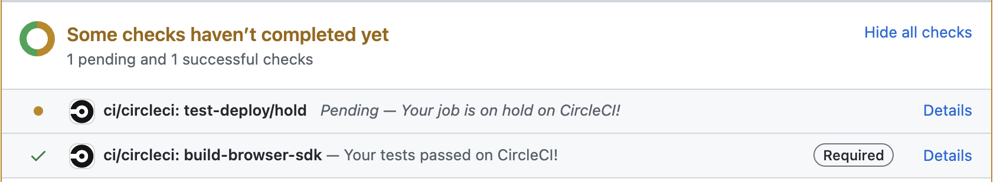

# Releasing fullstory-browser-sdk on npm

- Create a branch to contain the version bump/changelog changes, e.g.: `git checkout -b prepare-release-X.Y.Z`
- Add the new version to `CHANGELOG.md` and document notable changes since the previous release.
  - To list changesets since the previous release: `git log ^vA.B.C HEAD`, where `A.B.C` is the previous release version. For example, if the previous release was `1.6.0`: `git log ^v1.6.0 HEAD`.
  - Call out notable changes individually, minor changes such as bumping dependency versions can be lumped into a single point.
- Commit changelog changes: `git add CHANGELOG.md; git commit -m "update changelog for A.B.C"`.
- Use `npm version` to bump the package version and create a git tag for it: `npm version [major|minor|patch] -m "Release version %s"`.
  - Use `major` for breaking API changes, `minor` for non-breaking API changes, and `patch` for minor bug fixes/improvements.
- Create a pull request for the changes: `gh pr create` (if you have installed the [GitHub Commandline tool](https://cli.github.com/)).
- Push the new tag to the repo, which triggers the CircleCI automation to publish the npm package: `git push --tags`.
- Open the Pull Request you just created on GitHub, you will see the CircleCI `test-deploy` job is on hold. Click through to CircleCI, then click on the _hold_ step to approve the task. 
- Get approval for the pull request and merge it.
